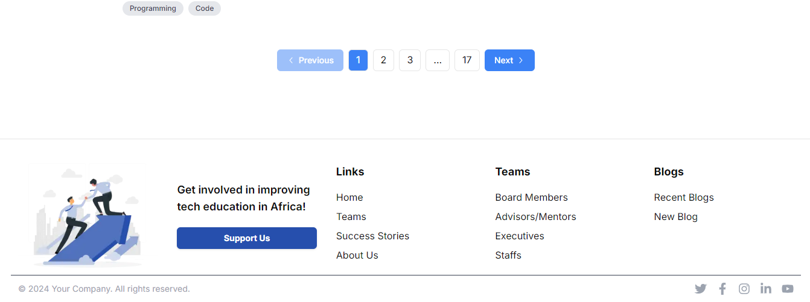
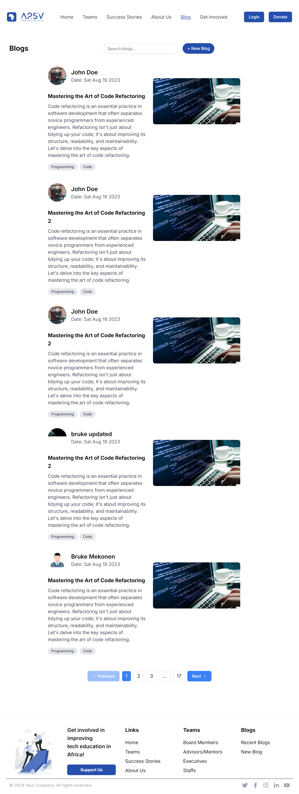
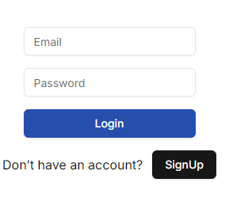
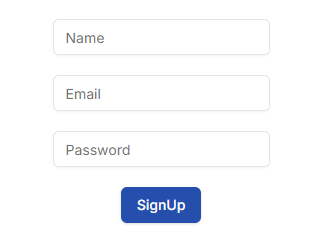

# A2SV Blog README
Deploy Link: https://a2-sv-blog.vercel.app/
## Overview

Name: Rebuma Tadele
This project is a Next.js application with integrated Redux for state management and TypeScript for type safety. It includes user authentication, conditional routing based on user tokens, and a dynamic Navbar component with search functionalities.

## Features

- **User Authentication**: Manages user sign-in and sign-out.
- **Blog Control**: Manages Blog issues.
- **Member Control**: Manages member Control issues.
- **Real-Time Search Capabilities**: Performs Search over the blogs.
- **Redux Store**: Stores Blog and User data in Redux Store.
- **Conditional Routing**: Redirects users based on the presence of an authentication token.
- **Dynamic Navbar**: Displays different buttons and links based on user authentication status.
- **Redux Integration**: Manages user state using Redux.

## Screenshots








### Prerequisites

- Node.js (v16 or higher)
- npm or Yarn

### Installation

1. **Clone the Repository**
   ```bash
   git clone https://github.com/rebumatadele/A2SV-Blog.git
